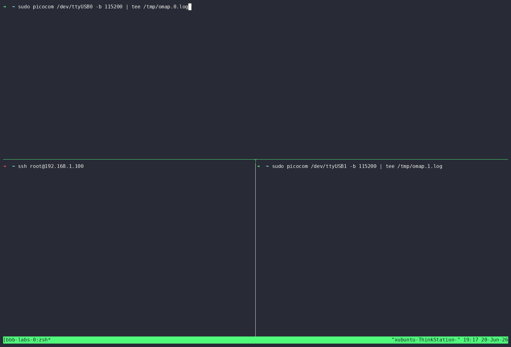
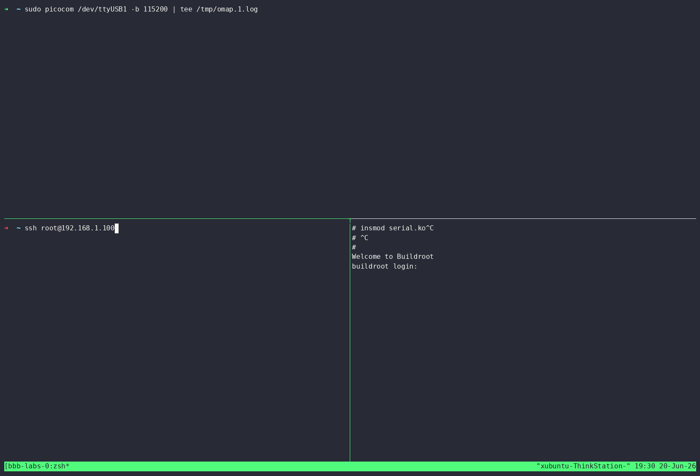

# Bootlin Linux Kernel Labs (BeagleBone Black)

Self-paced completion of [Bootlin’s Linux kernel and driver development training](https://bootlin.com/training/kernel) on a BeagleBone Black — out-of-tree drivers, device tree, and userspace demos on real hardware.

## Bootlin materials

| Resource | Link |
|----------|------|
| Training overview | [bootlin.com/training/kernel](https://bootlin.com/training/kernel) |
| BBB lab instructions (PDF) | [linux-kernel-bbb-labs.pdf](https://bootlin.com/doc/training/linux-kernel/linux-kernel-bbb-labs.pdf) |
| Lab data tarball | [linux-kernel-bbb-labs.tar.xz](https://bootlin.com/doc/training/linux-kernel/linux-kernel-bbb-labs.tar.xz) |
| All training docs | [bootlin.com/doc/training/linux-kernel/](https://bootlin.com/doc/training/linux-kernel/) |

Custom kernel branch with device-tree changes: [github.com/FaizAther/linux/tree/bootlin-labs](https://github.com/FaizAther/linux/tree/bootlin-labs)

## Demos

### Nunchuk — I2C input driver

Wii Nunchuk over I2C: joystick (`ABS_X`/`ABS_Y`), C/Z buttons, stick zones mapped to arrow keys.



```sh
cd nunchuk && ./build.sh
insmod nunchuk.ko
./nunchuk_user.exe          # live joystick display
evtest                      # full input events
```

### Serial — platform UART driver

OMAP UART with IRQ RX, ring buffer, `read()`/`poll()`, and PIO or DMA TX (runtime switch via ioctl).



```sh
cd serial && ./build.sh
insmod serial.ko
./serial_user.exe -m dma /dev/bootlin_uart_48024000.serial
```

## Labs in this tree

| Directory | Lab topic |
|-----------|-----------|
| `hello/` | First kernel module |
| `nunchuk/` | I2C + input subsystem (Nintendo Wii Nunchuk) |
| `serial/` | Platform driver, interrupts, DMA |
| `debugging/` | Kernel oops analysis, debugfs dynamic debug |

## Recording demos

`record-demo.sh` sets up a tmux session (dmesg on top, shell on bottom) for [asciinema](https://asciinema.org/) recordings:

```sh
./record-demo.sh start
asciinema rec demo.cast
```

Convert a recording to GIF with [agg](https://github.com/asciinema/agg):

```sh
agg demo.cast demo.gif
```

## Thanks

These labs are excellent hands-on material — thank you to [Bootlin](https://bootlin.com) for publishing them under an open license.
